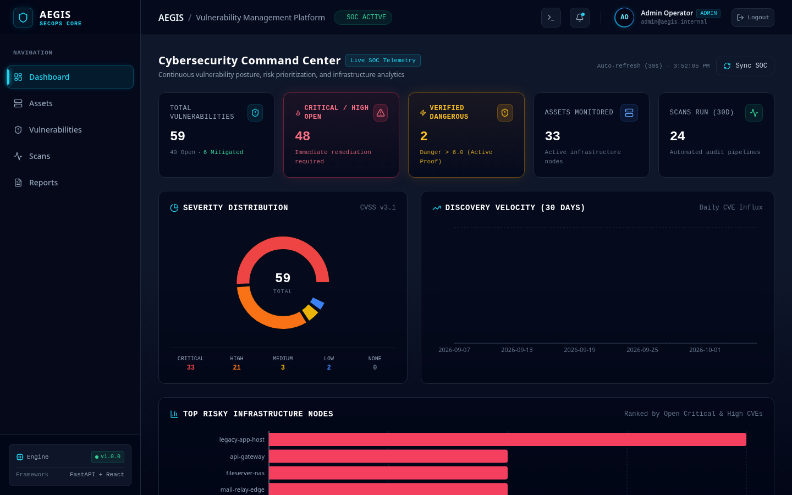
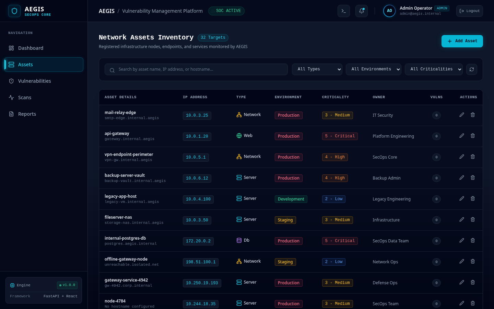
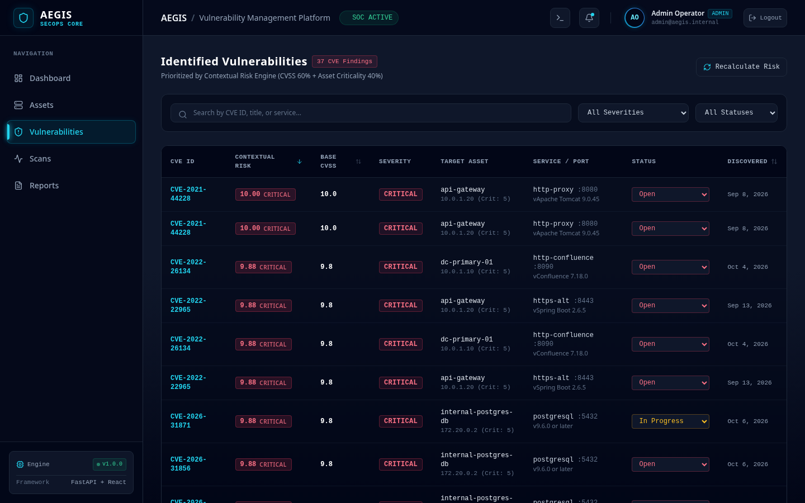
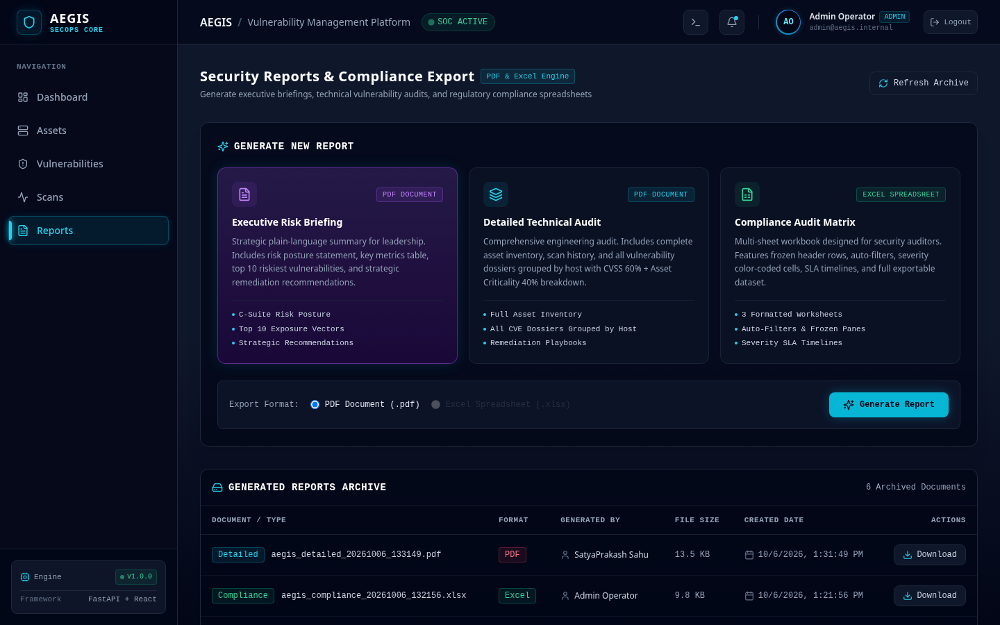
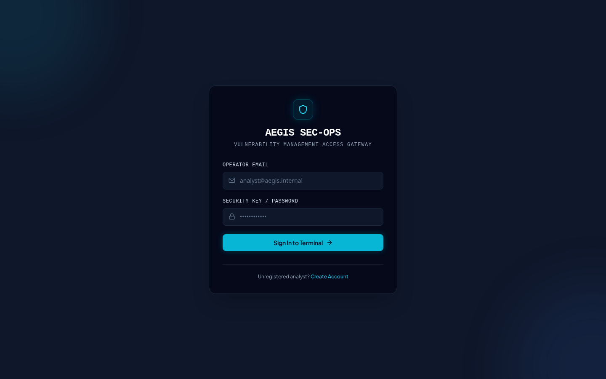
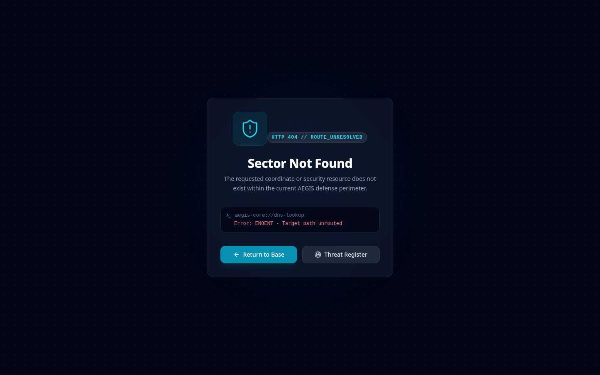
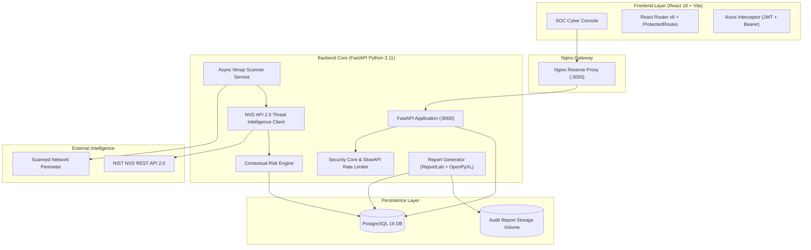

# AEGIS - Continuous Vulnerability Management Platform

<p align="center">
  
</p>

<p align="center">
  <strong>Enterprise-Grade Cybersecurity Vulnerability Intelligence, Automated Infrastructure Discovery & Risk Prioritization Engine</strong>
</p>

<p align="center">
  <a href="#license"></a>
  <a href="#architecture"></a>
  <a href="https://fastapi.tiangolo.com/"></a>
  <a href="https://react.dev/"></a>
  <a href="https://www.postgresql.org/"></a>
  <a href="https://nmap.org/"></a>
  <a href="https://github.com/projectdiscovery/nuclei"></a>
  <a href="https://github.com/projectdiscovery/subfinder"></a>
  <a href="https://github.com/projectdiscovery/httpx"></a>
  <a href="https://testssl.sh/"></a>
  <a href="https://docker.com/"></a>
  <a href="https://tailwindcss.com/"></a>
</p>

---

## Executive Overview

**AEGIS** is a modern, production-hardened continuous vulnerability management and security operations platform. Designed from the ground up to solve vulnerability fatigue, AEGIS does not merely catalog CVEs—it synthesizes **network perimeter discovery**, **authoritative threat intelligence from the National Vulnerability Database (NVD API 2.0)**, and **business context** to calculate accurate composite risk scores. 

With AEGIS, security teams prioritize vulnerabilities that actually threaten business-critical systems, generate audit-ready PDF/Excel compliance deliverables, and protect enterprise infrastructure through automated scanning pipelines.

---

## Platform Visual Showcase

### 1. Cybersecurity Command Center (Live SOC Telemetry)
Real-time posture analytics featuring donut severity distributions, 30-day vulnerability velocity curves, high-risk infrastructure nodes, and instant telemetry synchronization.


---

### 2. Network Assets Inventory & Criticality Mapping
Granular infrastructure directory categorized by role (Server, Web, Database, Network), deployment environment (Production, Staging, Dev), and business criticality (1-5).


---

### 3. Vulnerability Register & Contextual Risk Prioritization
Vulnerabilities ordered by contextual risk score ($$\text{CVSS } 60\% + \text{Asset Criticality } 40\%$$) with interactive drawers, CVE exploit vectors, and remediation status updates.


---

### 4. Security Reports & Compliance Engine
On-demand generation of Executive Risk Briefings (PDF), Detailed Technical Audits (PDF), and multi-tab Compliance Audit Matrices (Excel).


---

### 5. Resilient SOC Experience (Authentication & Exception Handling)
Dark SOC theme with JWT role-based access control, account lockout protection, and contextual 404 security exception routing.
| Authentication Portal | Security Sector 404 Exception |
| :---: | :---: |
|  |  |

---

## Core Capabilities

- **Real-World Web Reconnaissance Engine & Live Progress Reporting (Phase 8.3):**
  - **Stage 1 (Subdomain Discovery):** Automated passive OSINT subdomain enumeration using ProjectDiscovery `subfinder v2.16` (up to 100 subdomains).
  - **Stage 2 (Live Web Probing & Tech Detection):** High-speed multi-threaded probing with ProjectDiscovery `httpx v1.12` extracting status codes, page titles, CDN edge detection, and software stacks.
  - **Stage 3 (CDN-Aware Smart Port & NSE Scanning):** CDN IPs scanned light (top 100 ports); true origin IPs scanned deep (top 500 ports + Nmap NSE `vuln` scripts).
  - **Stage 4 (Expanded Nuclei Dynamic Web Exploitation):** Probes live discovered virtual hosts with Nuclei v3 for active CVEs, exposures, and misconfigurations.
  - **Stage 5 (SSL/TLS Cryptographic Audit):** Evaluates cipher strength, deprecated protocols (TLS 1.0/1.1), missing HSTS headers, Heartbleed, ROBOT, and cert validity via `testssl.sh`, tagging findings with purple `SSL Audit ✓` badges.
  - **Stage 6 (Software Stack Version Advisories):** Cross-references discovered web runtime versions (WordPress, Apache, PHP, nginx, Gunicorn) against known advisories.
  - **Stage 7 (Dossier Aggregation & Prioritization):** Stores full reconnaissance profile in `raw_output.recon` and deduplicates findings.
  - **Live Progress Telemetry:** Background scans continuously report `current_stage`, `stage_number`, `stages_total`, `detail`, and host counters in `scans.progress`, rendered in the UI with animated percentage bars and elapsed timers.
  - **Reconnaissance Summary Dossier:** Interactive modal displays discovered subdomain tags, live endpoint status, detected technology pill badges, and CDN bypass indicators.
- **Deep Active Vulnerability Verification (Phase 8):**
  - **Stage 1 (Port & Service Sweep):** Fast discovery across top 500 ports using `-T4 -sV`.
  - **Stage 2 (Nmap NSE Active Audits):** Targets discovered services with the Nmap Scripting Engine (`--script vuln`) to actively verify exploits like MS17-010, BlueKeep, and Heartbleed, capturing raw output proof.
  - **Stage 3 (Nuclei v3 Dynamic Exploitation):** Executes ProjectDiscovery Nuclei v3 streaming against exposed web/API endpoints with baked-in vulnerability templates, extracting HTTP match telemetry and proof-of-concept indicators.
  - **In-Place Upgrades:** Re-scans upgrade findings from `version_match` to `nse_verified` or `nuclei_verified` without creating duplicate CVE records.
- **Threat Danger Assessment Engine:**
  - Evaluates ease of exploitation (weaponized public exploit, Metasploit integration, remote vs local).
  - Assesses blast radius and threat impact (Remote Code Execution, Privilege Escalation, SQLi, Authentication Bypass, Information Disclosure).
  - Flags weaponized exploits with 🔥 in tables and SOC dashboards.
- **Direct Target Scanning & Auto-Discovery (Phase 8.2):**
  - **Zero Pre-Registration Scanning:** Scan any IP address, domain, or URL directly from the Scans page without pre-registering an asset in inventory.
  - **Intelligent Target Deduplication:** Automatically checks existing inventory for matching IP addresses or resolved DNS records, re-using existing assets without duplication.
  - **Silent Asset Creation & AUTO Badging:** Automatically provisions new inventory entities with `AUTO` badge indicators, baseline criticality, and `Auto-Discovered` ownership.
  - **Smart Post-Scan Asset Classification:** Infers asset type from discovered open ports (e.g., ports 80, 443, 3000 -> `Web`; ports 5432, 3306 -> `Db`; otherwise `Server`).
  - **Demo Data Lifecycle Management:** Admin utility and UI button ("Clear Demo Data") to cleanly wipe seeded demonstration fixtures while preserving operator-scanned targets.
- **Domain & URL Target Support with Auto DNS Resolution (Phase 8.1):**
  - **Flexible Ingestion:** Accepts IPv4 addresses, domain hostnames (`example.com`), and complete URLs (`https://example.com:8080/api`).
  - **URL Normalization:** Automatically strips protocols, userinfo, paths, queries, and port suffixes.
  - **Dynamic DNS Resolution:** Resolves domains to IPv4 addresses via `socket.getaddrinfo`, caching `resolved_ip` in the database.
  - **Bidirectional Deduplication:** Prevents duplicate registrations whether an asset is registered by domain, URL, or its resolved IP.
  - **Adaptive Scan Routing:** Scanner pipelines (Quick, Full, Deep) seamlessly target the live resolved IP while attributing all telemetry to the parent domain.
  - **Visual SOC Indicators:** Dedicated 🌐 domain badges with resolved IP subtitles and 🖥️ hardware host icons in the UI.
- **Automated Network Port & Service Discovery:** Asynchronous Nmap engine executing Quick (top 100 ports), Full (ports 1-1000), and Deep (active proof) scans in non-blocking worker threads.
- **Threat Intelligence Enrichment:** Seamless NVD API 2.0 integration correlating CPE banners, service names, and versions directly to official CVE records with CVSS v3.1 scores.
- **Contextual Composite Risk Engine:** Eliminates alert fatigue by weighting technical severity against organizational asset criticality.
- **Pre-Configured Testbed (OWASP Juice Shop):** Bundles a dedicated vulnerable test target (`aegis-juice-shop` on port 3001) for safe, authorized active vulnerability verification out of the box.
- **Compliance & Audit Deliverables:**
  - **Executive Risk Briefing (PDF):** Designed for executive leadership with risk posture summaries, metrics, and top 10 exposures.
  - **Detailed Technical Audit (PDF):** Full host dossiers with CVE descriptions, CVSS breakdowns, and remediation instructions.
  - **Compliance Audit Matrix (Excel):** Multi-sheet workbook with auto-filters, frozen panes, severity color-coding, and SLA tracking.
- **Defense-in-Depth Security Hardening:**
  - SlowAPI distributed rate limiting (100 req/min auth routes, 300 req/min general API).
  - Exponential brute-force lockout: 5 consecutive failed login attempts trigger an automatic 15-minute account lock.
  - Hardened HTTP security headers: `X-Content-Type-Options: nosniff`, `X-Frame-Options: DENY`, `X-XSS-Protection: 1; mode=block`, and `Referrer-Policy: strict-origin-when-cross-origin`.
  - SQLAlchemy 2.0 strictly parameterized async queries.
  - Production secret key fail-fast validation on startup.

---

## Scoring Algorithms

### 1. Contextual Risk Score (Business Impact)
Traditional vulnerability management relies solely on raw CVSS scores, leading teams to patch low-impact vulnerabilities on test boxes while ignoring high-risk flaws on crown-jewel databases:
$$\text{Asset Criticality Weight} = \left(\frac{\text{Criticality}}{5}\right) \times 10$$
$$\text{Risk Score} = \text{round}\left((\text{CVSS Base Score} \times 0.6) + (\text{Asset Criticality Weight} \times 0.4), 2\right)$$

### 2. Threat Danger Score (Real-World Exploitability)
Beyond business criticality, the Danger Assessment Engine evaluates actual exploitation hazard:
$$\text{Danger Score} = \text{round}\left((\text{CVSS Base Score} \times 0.40) + (\text{Exploit Ease} \times 0.35) + (\text{Impact Severity} \times 0.25), 2\right)$$
- **Exploit Ease (0-10):** Measures whether exploit code is public, weaponized in frameworks (Metasploit, Nuclei), or requires authenticated complex chaining.
- **Impact Severity (0-10):** Measures catastrophic potential (RCE = 10, Auth Bypass/SQLi = 8-9, Data Leak = 4-6, DoS = 3-5).

### Risk Tier Classifications

| Risk Score Range | Classification Tier | SLA Remediation Window | Action Required |
| :---: | :---: | :---: | :---: |
| **9.0 - 10.0** | <span style="color:#ef4444;font-weight:bold;">CRITICAL</span> | 24 - 48 Hours | Emergency patch / immediate network isolation |
| **7.0 - 8.9** | <span style="color:#f97316;font-weight:bold;">HIGH</span> | 7 Days | Scheduled engineering sprint remediation |
| **4.0 - 6.9** | <span style="color:#eab308;font-weight:bold;">MEDIUM</span> | 30 Days | Routine maintenance window deployment |
| **0.1 - 3.9** | <span style="color:#3b82f6;font-weight:bold;">LOW</span> | 90 Days | Backlog review / architectural hardening |

---

## Architecture & System Design



---

## API Reference

All protected endpoints require a valid Bearer JWT token in the `Authorization` header (`Authorization: Bearer <TOKEN>`).

| Method | Endpoint | Access Role | Description |
| :--- | :--- | :--- | :--- |
| `POST` | `/api/auth/register` | Public (Rate Limited) | Register analyst user (first user becomes Admin) |
| `POST` | `/api/auth/login` | Public (Rate Limited) | OAuth2 Password login returning JWT bearer token |
| `GET` | `/api/auth/me` | Authenticated | Retrieve current user profile and role |
| `GET` | `/api/assets` | Authenticated | Paginated, searchable, and filtered asset list |
| `POST` | `/api/assets` | Admin, Analyst | Register new infrastructure asset |
| `GET` | `/api/assets/{id}` | Authenticated | Get asset details with severity breakdown |
| `PUT` | `/api/assets/{id}` | Admin, Analyst | Update asset parameters and criticality |
| `DELETE`| `/api/assets/seed` | Admin | Cleanly delete seeded demo assets and cascading findings |
| `DELETE`| `/api/assets/{id}` | Admin | Delete asset and cascade associated vulnerabilities |
| `POST` | `/api/scans/direct` | Admin, Analyst | Direct scan on arbitrary target (auto-creates or reuses asset) |
| `POST` | `/api/scans` | Admin, Analyst | Launch quick, full, or deep active scan job on registered asset |
| `GET` | `/api/scans` | Authenticated | List historical scans with status and findings |
| `GET` | `/api/scans/{id}` | Authenticated | Get scan run status and raw port execution telemetry |
| `GET` | `/api/vulns` | Authenticated | Paginated vulnerabilities with `?verification=` and `?min_danger=` filters |
| `GET` | `/api/vulns/{id}` | Authenticated | Get full vulnerability detail dossier with evidence and danger metrics |
| `PATCH`| `/api/vulns/{id}/status` | Admin, Analyst | Update remediation lifecycle (`open`, `in_progress`, `mitigated`) |
| `POST` | `/api/vulns/recalculate-risk` | Admin | Batch recalculate composite risk scores across all assets |
| `GET` | `/api/dashboard/summary` | Authenticated | Top-level KPI summary cards including verified dangerous count |
| `GET` | `/api/dashboard/top-dangerous-vulns` | Authenticated | Top 5 dangerous vulnerabilities ranked by composite danger score |
| `GET` | `/api/dashboard/severity-distribution` | Authenticated | Severity counts for donut chart |
| `GET` | `/api/dashboard/trend` | Authenticated | 30-day vulnerability discovery velocity |
| `GET` | `/api/dashboard/top-risky-assets` | Authenticated | Top vulnerable assets ordered by critical/high count |
| `POST` | `/api/reports/generate` | Admin, Analyst | Generate Executive PDF, Technical PDF, or Excel matrix |
| `GET` | `/api/reports` | Authenticated | List all generated audit report archives |
| `GET` | `/api/reports/{id}/download` | Authenticated | Stream and download generated report file |

---

## Quickstart Guide

### Prerequisites
- [Docker](https://docs.docker.com/get-docker/) (v24.0+) & Docker Compose (v2.20+)
- Git

### 1. Clone Repository & Setup Environment
```bash
git clone https://github.com/Satyaprakash37/aegis.git
cd aegis
cp .env.example .env
```

### 2. Launch Entire Platform
```bash
docker compose up --build -d
```

### 3. Seed Realistic Demonstration Telemetry
Populate the platform with 8 real infrastructure assets, 5 historical scans, and 16 genuine CVE records (Log4Shell, Citrix Bleed, Spring4Shell, Heartbleed, BlueKeep, Zerologon, etc.) with real CVSS scores:
```bash
docker compose exec backend python -m scripts.seed
```

### 4. Access Security Console
- **Frontend Dashboard:** [http://localhost:3000](http://localhost:3000)
- **Interactive Swagger Docs:** [http://localhost:8000/docs](http://localhost:8000/docs)
- **ReDoc Documentation:** [http://localhost:8000/redoc](http://localhost:8000/redoc)

#### Default Demo Credentials
- **Username:** `admin@aegis.internal`
- **Password:** `SuperSecretPassword123`

---

## Roadmap

- [ ] **Distributed Scanning Agents:** Deploy lightweight remote Nmap worker nodes across VPCs and cloud regions via Celery + Redis.
- [ ] **Jira & ServiceNow Integration:** Automated bi-directional ticketing when vulnerabilities exceed Critical risk thresholds.
- [ ] **EPSS (Exploit Prediction Scoring System):** Factor real-time probability of exploitation in the wild into the composite risk equation.
- [ ] **SSO / SAML 2.0 Integration:** Okta, Azure AD, and Google Workspace Enterprise SSO.
- [ ] **Automated Web Application Scanning:** Integrate OWASP ZAP and Nuclei for active application-layer fuzzing.

---

## License

This project is licensed under the MIT License - see the [LICENSE](LICENSE) file for details.
